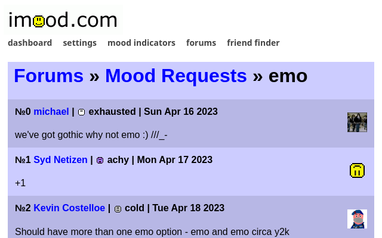
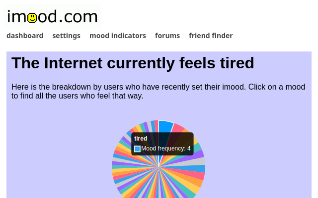

<div style="text-align:center;"></div>

# imood++

### [chrome](https://chromewebstore.google.com/detail/imood++/oooolmgjjlfahaenjbdplplfljkabkmk) | firefox

imood++ is a web extension created by [hoylecake on imood](https://www.imood.com/users/hoylecake) that improves parts of the frontend

if you want to use it locally, find [the latest release](https://github.com/roxwize/imood-plusplus/releases) and download it as a zip&mdash; load it into your browser's extensions manager from there. pre-packaged versions on the firefox addons marketplace will come ASAP

## features

- turn the table-based forum layout into a simpler, purely vertical one (see below for screenshots)
- add a piechart to the internet mood and personal mood pages to view mood frequencies

## screenshots



revamped forum layout... whoa...



look at those colors ...

## installing from source

clone the repository first, then download the modules using your package manager of choice. then run the `build` script, or `dev` to have it rebuilt as you make changes

```bash
git clone https://github.com/roxwize/imood-plusplus.git
cd imood-plusplus
pnpm install
pnpm dev
```
