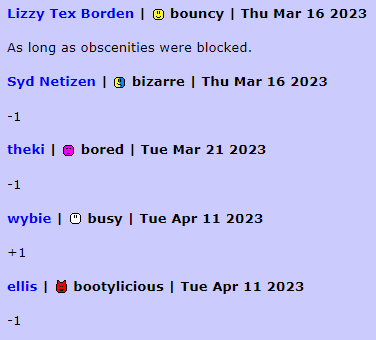

# imood subjectively better forum

manifest-v3 based extension for every browser ever made\* that turns forum thread layout into THIS....:

\*aslong as it supports manifest v3

**THE CREATOR'S IMOOD IS [HERE](https://www.imood.com/users/hoylecake) CHECK IT OUT**

also his alt-website where he puts code stuff is [here](https://thekifake.github.io) he might like put documentation for the extension soon maybe idk

## license

this is licensed under the cc0 liecnce which maeans you can do whateve you want with it lulz

## instructions for adding to your browser

at this moment its manual but eventually it will be ported to the chrome web store and firefox add-ons marketplace

### chromium

chromium based browsers include chrome and vivaldi. i use vivaldi but the process should be extremely similar to chrome

1. download the repository as a zip file to your computer
2. unzip the zip file and store it somewhere
3. go to your browser's extension page ([chrome://extensions](chrome://extensions) if on chrome, [vivaldi://extensions](vivaldi://extensions) if on vivaldi)
4. click **Load unpacked** and select the folder containing the repository you just unzipped
5. it is finished

### firefox

idk #lolz B)
